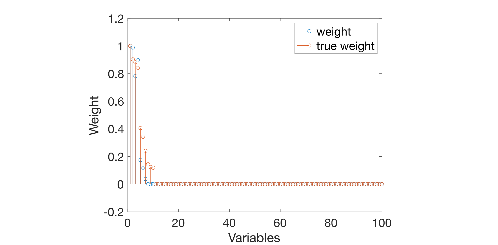
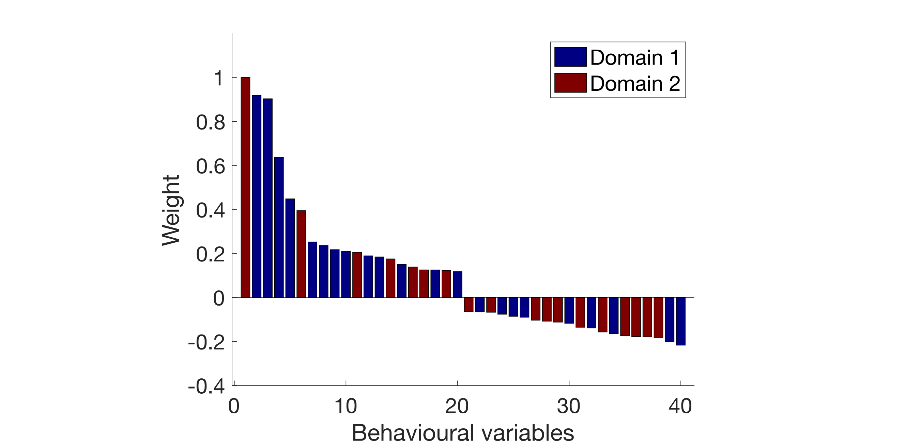

__plot_weight__

It plots the model weights in specific figures based on the modality of 
the data. 

##  Syntax
      plot_weight(res, mod, modtype, split, func, varargin)
    
##  Inputs
*   **res** [*struct*]
    
    res structure containing information about results and plot specifications
    
*   **mod** [*'X', 'Y'*]
    
    modality of data to be used for plotting
    
*   **modtype** [*'behav', 'conn', 'vbm', 'roi', 'simul'*]
    
    type of data
    
*   **split** [*int*]
    
    index of data split to be used
    
*   **func** [*'behav_horz', 'behav_vert', 'behav_text', 'brain_conn_node', 'brain_cortex', 'brain_edge', 'brain_module', 'brain_node', 'stem'*]
    
    name of the specific plotting function (after `plot_weight_*` prefix) to
    be called
    
*   **varargin** [*name-value pairs*]
    
    additional options can be passed via name-value pairs with dot notation
    supported (e.g., 'behav.weight.numtop', 20)
    
##  Examples
###  Modality independent
      % Plot Y weights as stem plot
      plot_weight(res, 'Y', 'simul', res.frwork.split.best, 'stem', ...
      'gen.axes.YLim', [-0.2 1.2], 'simul.weight.norm', 'minmax', ...
      'gen.axes.FontSize', 20, 'gen.legend.FontSize', 20);
    

###  Behaviour
      % Plot behavioural weights as vertical bar plot
      plot_weight(res, 'Y', 'behav', res.frwork.split.best, 'behav_vert', ...
      'gen.axes.FontSize', 20, 'gen.legend.FontSize', 20, ...
      'gen.axes.YLim', [-0.4 1.2], 'gen.weight.flip', 1, ...
      'behav.weight.sorttype', 'sign', 'behav.weight.numtop', 20, ...
      'behav.weight.norm', 'minmax');
    

###  ROI-wise sMRI
      % Plot ROI weights on a glass brain
      plot_weight(res, 'X', 'roi', 1, 'brain_node', ...
      'roi.weight.sorttype', 'sign', 'roi.weight.numtop', 20, ...
      'roi.out', 9000 + [reshape([1:10:81; 2:10:82], [], 1); ...
      reshape(100:10:170, [], 1)]);
    

###  fMRI connectivity edges
      % Plot connectivity weights on glass brain
      plot_weight(res, 'X', 'conn', res.frwork.split.best, 'brain_edge', ...
      'conn.weight.sorttype', 'sign', 'conn.weight.numtop', 20);
    

---
See also: [plot_paropt](../plot_paropt), [plot_proj](../plot_proj)

