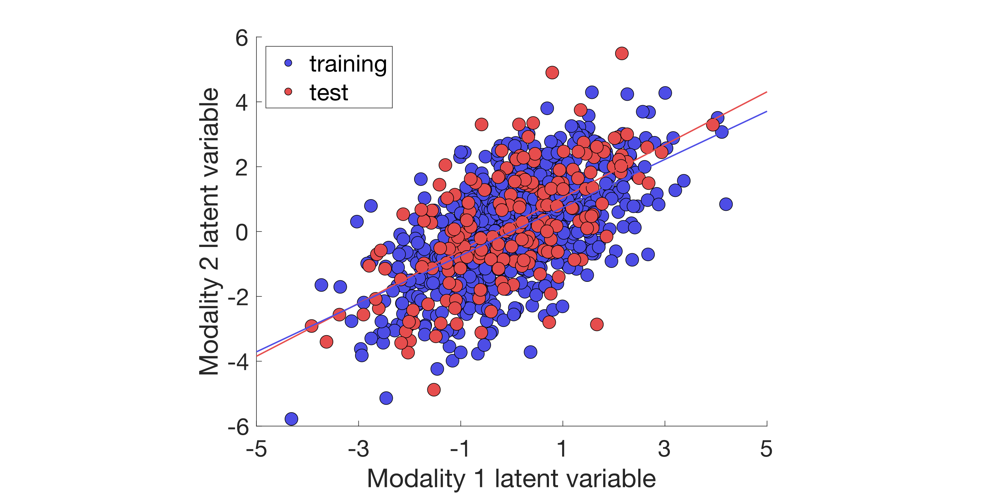

!!! info "Dependencies"

	The visualization functions can have multiple dependencies.
	
	In general, if you want to use an interactive file selection, (i.e., pop-up dialog box to choose input files when needed), you need [SPM](https://www.fil.ion.ucl.ac.uk/spm/software/download/). You also need SPM if you work with a mask or an atlas. For details on these, please see below.
	
	If you want to plot brain weights on a glass brain, you need [BrainNet Viewer](https://www.nitrc.org/projects/bnv/). We use BrainNet Viewer in the toolkit for plotting structural MRI weights either at the voxel or ROI level as well as fMRI connectivity weights either at the edge level or summarized by nodes. We suggest that you manually edit your preferred settings in the BrainNet Viewer GUI at first usage and save these options as `otions.mat` then the toolkit will be able to automatically set your configurations for the BrainNet figure in successsive plots.


## Overview

There are three high-level functions to visualize your results:

1. [`plot_proj`](../mfiles/plot_proj): it plots the projections (or latent variables) of the data for an associative effect in a [simple plot](../mfiles/plot_proj/#simple-plots) or for multiple associative effects in a [multi-level plot](../mfiles/plot_proj/#multi-level-plots). It can plot training and/or test sets of specific data splits. You can colour-code the subjects in the figure by groups or a continuous variable.
2. [`plot_weight`](../mfiles/plot_weight): it plots the model weights in specific formats. You can plot behavioural weights using text, vertical or horizontal bar plots. The brain weights can be plotted on a glass brain using [BrainNet Viewer](https://www.nitrc.org/projects/bnv/) either as a map for voxel-level weights, as nodes for region-level weights and summarized connectivity weights or as edges for connectivity weights. You can also summarize connectivity weights as within and between-module connectivities.
3. [`plot_paropt`](../mfiles/plot_paropt): it plots the grid search results of the hyperparameter optimization and it is a useful tool for diagnostics. It can visualize each metric in `cfg.machine.metric` as a function of hyperparameters irrespectively whether the requested metric was used as criterion for hyperparameter selection or not. Each metric is plotted in a separate subplot.

These high-level functions will call low-level functions for a specific variation of a plot. A full list of high- and low-level plotting functions is illustrated in the following figure.

<p align="center">
   
</p>


The low-level functions are specified by the `func` argument of the high-level functions. For instance:

- to use the `plot_proj_2d_group` function, you need to call `plot_proj` with a `2d_group` argument,
- to use the `plot_weight_behav_horz` function, you need to call `plot_weight` with a `behav_horz` argument.

```matlab
% Plot projections
plot_proj(..., '2d_group')

% Plot weights
plot_weight(..., 'behav_horz')
```

For a more detailed description of the high- and low-level functions, see the sections below.


## Configuration for plotting

The main input of the visualization is the `res` structure including all the settings for your visualization. You might remember that `res` was initialized during your analysis and saved into `res*.mat` (for details, see [Analysis](../analysis)).

First, we need to load the `res` structure either manually or using the [`res_defaults`](../mfiles/res_defaults) function as shown below. In the latter case, you need to initialize `res` with `res.dir.frwork` and `res.frwork.level` to inform `res_defaults` which `res*.mat` file to load.

```matlab
% Load res
res.dir.frwork = 'PATH/TO/YOUR/SPECIFIC/FRAMEWORK';
res.frwork.level = 1;
res = res_defaults(res, 'load');
```

Once loaded, `res` can be populated with the following fields for the visualization of the results:

- `gen`: general options (e.g., interactive file selection) and settings (e.g., position, font size) for the figure, axes and legend,
- `param`: options for plotting the results of hyperparameter optimization, 
- `proj`: options for plotting the projections of the data,
- `behav`: options for plotting the behavioural weights,
- `conn`: options for plotting the fMRI connectivity weights,
- `vbm`: options for plotting the voxel-level structural MRI weights,
- `roi`: options for plotting the region-level structural MRI weights,
- `simul`: options for plotting the weights of simulated data,
- `brainnet`: options for using [BrainNet Viewer](https://www.nitrc.org/projects/bnv/).

!!! info "Info"

        Note that the fields for visualization are only temporarily added to `res` and not saved in the `res*.mat` file.


To get a more detailed description of the fields and subfields of `res`, please see [here](../res).


## Projections

One of the first results of your analysis that you will probably want to visualize is the projections of the data (i.e., latent variables) that are learnt by the CCA/PLS model. This plot can be created by the [`plot_proj`](../mfiles/plot_proj) function, which has the following required inputs: the `res` structure, the data modalities and the level of the associative effect, the type (outer and/or inner) and index of the data split, label for colour-coding the plot, and finally, the low-level function to use ('2d', '2d_group' or '2d_cmap').

The most simple projection plot can be created using the low-level function `plot_proj_2d`, which does not require any additional input files.

```matlab
% Plot data projections
plot_proj(res, {'X' 'Y'}, res.frwork.level, 'osplit', 1, 'none', '2d');
```


The two other low-level functions allow you to colour-code your scatter plot by a continuous variable (`plot_proj_2d_cmap`) or groups (`plot_proj_2d_group`). There are different ways to define the colour-code:

- providing a `group.mat` file in your data folder, which should include a numeric array to define the colour map or groups,
- using the outer training and test sets to define the groups,
- providing a data and label file, where the data file should include the variable(s) and the label file should include the name of the variables to define the colour map or groups (by default, `Y.mat` and `LabelsY.csv` are used for these purposes but custom data and label files are also possible).

In this example, we use `plot_proj_2d_group` to create a more advanced plot of the same data by also defining additional figure, axes and legend settings. 

```matlab
% Plot data projections
plot_proj(res, {'X' 'Y'}, res.frwork.level, 'osplit', 1, ...
    'training+test', '2d_group', 'gen.axes.FontSize', 20, ...
    'gen.legend.FontSize', 20, 'gen.legend.Location', 'NorthWest', ... 
    'proj.scatter.SizeData', 120, 'proj.scatter.MarkerEdgeColor', 'k', ...
    'proj.scatter.MarkerFaceColor', [0.3 0.3 0.9; 0.9 0.3 0.3], ...
    'proj.xlabel', 'Modality 1 latent variable', ...
    'proj.ylabel', 'Modality 2 latent variable', ...
    'gen.axes.XTick', [-5:2:5], 'proj.lsline', 'on');
```




## Weights

Another important part of the analysis results are the model weights of the learnt associative effect. The visualization of the weights are data modality dependent. For instance, the behavioral weights usually have only a few dimensions and can be best captured using a vertical or horizontal bar plot. The brain weights can be higher dimensional and their visualization might change depending on whether they belong to voxel-wise or region-of-interest structural MRI data, or fMRI connectivity data.

### Modality independent

A data modality independent visualization can be achieved using a stem plot (`plot_weight_stem`). It does not require an input file by default. However, if you use simulated data and the true model weights are available as `.mat` files, you can overlay them on your stem plot.

```matlab
% Plot Y weights as stem plot
plot_weight(res, 'Y', 'simul', res.frwork.split.best, 'stem', ...
    'gen.axes.YLim', [-0.2 1.2], 'simul.weight.norm', 'minmax', ...
    'gen.axes.FontSize', 20, 'gen.legend.FontSize', 20);
```


### Behaviour

The behavioural weights can be best plotted using a bar graph, either vertically (`plot_weight_behav_vert`) or horizontally (`plot_weight_behav_horz`). Usually, only the top weights are plotted (e.g., the top 20 variables) and they are ordered by their actual weight values. Sometimes it might also be good to color in different behavioural domains such as cognition, emotion, clinical symptoms, psychometrics, or simply different questionnaires. 

Alternatively, the behavioural weights can be plotted as texts using `plot_weight_behav_text`. In this case, the weights themselves are actually not visualized (except of the minimum and maximum values), but the labels of the corresponding variables are displayed as text, separately for the positive and negative weights. This visualization makes sense if the labels are ordered based on the weights.

To create these plots, a label file (usually a `.csv` file but can be any delimited file) is required with the following column headings:

- `Label`: describing the name or label of the variables,
- `Category` (optional): describing the different domains/categories the variables belong to.

An example table is shown below.

| Label | Category |
|-------|----------|
| '1'   |'Domain 1'|
| '2'   |'Domain 2'|
| '3'   |'Domain 1'|

```matlab
% Plot behavioural weights as vertical bar plot
plot_weight(res, 'Y', 'behav', res.frwork.split.best, 'behav_vert', ...
    'gen.axes.FontSize', 20, 'gen.legend.FontSize', 20, ...
    'gen.axes.YLim', [-0.4 1.2], 'gen.weight.flip', 1, ...
    'behav.weight.sorttype', 'sign', 'behav.weight.numtop', 20, ...
    'behav.weight.norm', 'minmax');
```


### Brain

Plotting brain weights is probably the most complex as the dimensionality and type of data can be quite different across data modalities (e.g., voxel-wise, region-based, connectivity). These plots also need the most additional inputs.


#### Voxel-wise sMRI 

Vowel-wise structural MRI weights are plotted on a cortical surface of a glass brain using [BrainNet Viewer](https://www.nitrc.org/projects/bnv/) and the `plot_weight_brain_cortex` function. As the brain data is stored in concatenated form in the $\mathbf{X}$ matrix, this function requires a mask file to be able to reshape the brain weights into the same format as the original structural MRI data came from. The mask file should be a 3D image in `.nii` format including booleans that define which voxels are used as features in your $\mathbf{X}$ data (e.g., grey matter in the cortex).

By default, the brain weights will be overlaid on an MNI template provided by BrainNet Viewer (`BrainMesh_ICBM152.nv`) but you can also use our own mesh file if you like. In case your brain data is not in MNI space, you can use the built-in normalization option in the toolkit, which uses the reorientation, spatial preprocessing and normalize modules of [SPM](https://www.fil.ion.ucl.ac.uk/spm/software/download/). For this, you will need to make sure that your brain data are in relative proximity to MNI space and you need to provide a source image which will be used as a basis for normalization. 


#### ROI-wise sMRI

ROI-wise structural MRI weights are plotted on the cortical surface as nodes on a glass brain using [BrainNet Viewer](https://www.nitrc.org/projects/bnv/) and the `plot_weight_brain_node` function. This function requires a label file (usually a `.csv` file but can be any delimited file) with the following column headings:

- `X`, `Y` and `Z` coordinates of your regions (MNI coordinates by default),
- `Label`: describing the name or label of the regions,
- `Index` (optional): listing the indexes of the regions,
- `Color` (optional): specifying the colour of the region in the figure.

An example table is shown below.

|  X  | Y  | Z  |Index|Label|
|-----|----|----|-----|-----|
| -39 | -6 | 49 | 1   | 1   |
| 41  | -9 | 50 | 2   | 2   |
| -20 | 35 | 35 | 3   | 3   |

By default, the brain weights will be overlaid on an MNI template provided by BrainNet Viewer (`BrainMesh_ICBM152.nv`) but you can also use our own mesh file. Be careful that the coordinates in your label file match the space of your template file.

```matlab
% Plot ROI weights on a glass brain
plot_weight(res, 'X', 'roi', 1, 'brain_node', ...
    'roi.weight.sorttype', 'sign', 'roi.weight.numtop', 20, ...
    'roi.out', 9000 + [reshape([1:10:81; 2:10:82], [], 1); ...
    reshape(100:10:170, [], 1)]);
```


#### fMRI connectivity edges

fMRI connectivity weights can be plotted on the cortical surface as edges on a glass brain using [BrainNet Viewer](https://www.nitrc.org/projects/bnv/) and the `plot_weight_brain_edge` function. As the brain data are stored in a concatenated form in the $\mathbf{X}$ matrix, this function requires a mask file to be able to reshape the connections into a connectivity matrix. The mask file should be a 2D logical array in `.mat` format including a connectivity matrix (each row/column corresponding to a node) that defines which connections are used as features in your $\mathbf{X}$ data. 

In addition, a label file (ususally a `.csv` file but can be any delimited file) should be also provided with the following column headings:

  - `X`, `Y` and `Z` coordinates of your regions (MNI coordinates by default),
  - `Label`: defining the name or label of the regions,
  - `Index`: listing the indexes of the regions,
  - `Color` (optional): specifying the colour of the regions in the figure,
  - `Size` (optional): specifying the size of the regions in the figure.

For an example table, see the above section [here](#roi-wise-structural-mri).

By default, the brain weights will be overlaid on an MNI template provided by BrainNet Viewer (`BrainMesh_ICBM152.nv`) but you can also use our own mesh file. Be careful that the coordinates in your label file match the space of your template file.

```matlab
% Plot connectivity weights on glass brain
plot_weight(res, 'X', 'conn', res.frwork.split.best, 'brain_edge', ...
    'conn.weight.sorttype', 'sign', 'conn.weight.numtop', 20);
```


#### fMRI connectivity nodes

fMRI connectivity weights can be also plotted on the cortical surface summarized as nodes on a glass brain using [BrainNet Viewer](https://www.nitrc.org/projects/bnv/) and the `plot_weight_brain_conn_node`. This function requires the same mask files as the `plot_weight_brain_edge` function (for details, see the section above [here](#fmri-connectivity-edges)).

In addition, a label file (ususally a `.csv` file but can be any delimited file) should be also provided with the following column headings:

  - `X`, `Y` and `Z` coordinates of your regions (MNI coordinates by default),
  - `Label`: defining the name or label of the regions,
  - `Color` (optional): specifying the colour of the regions in the figure.

For an example table, see the section above.

By default, the brain weights will be overlaid on an MNI template provided by BrainNet Viewer (`BrainMesh_ICBM152.nv`) but you can also use our own mesh file. Be careful that the coordinates in your label file match the space of your template file.

```matlab
% Plot connectivity weights summarized as nodes on glass brain
plot_weight(res, 'X', 'conn', res.frwork.split.best, 'brain_conn_node', ...
    'conn.weight.sorttype', 'sign', 'conn.weight.numtop', 20);
```


#### fMRI connectivity modules

fMRI connectivity weights can be also summarized as modules and plotted as a connectivity matrix (i.e., within and between-module connections). This functionality is provided by the `plot_weight_brain_conn_module` function, which requires the same mask files as the `plot_weight_brain_edge` function (for details, see the section above [here](#fmri-connectivity-edges)).

In addition, a label file (ususally a `.csv` file but can be any delimited file) should be also provided with the following column headings:

  - `Region`: defining the module the regions belongs to.

An example table is shown below.

|Region|
|------|
| DMN  |
| DMN  |
| VIS  |


## Hyperparameters

One major advantage of the CCA/PLS tooklit is the possibility to tune the hyperparameters of the different models separately for each associative effect. It is good practice to visualize the hyperparameter surface to better understand the optimization process and the resulting final models. In this example, three surface plots are created showing the out-of-sample correlation and the similarity of $\mathbf{w}_x$ and $\mathbf{w}_y$ as a function of the two hyperparameters of the SPLS model (L1x, L1y).

 

```matlab
% Plot hyperparameter surface for grid search results
plot_paropt(res, 1, {'correl', 'simwx', 'simwy'}, ...
    'gen.figure.Position', [500 600 1200 400], 'gen.axes.FontSize', 20, ...
    'gen.axes.XScale', 'log', 'gen.axes.YScale', 'log');
```


